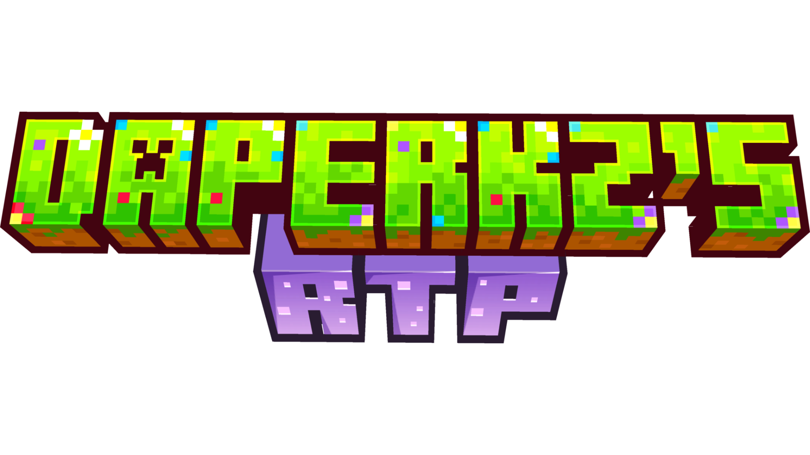

[](https://github.com)
[](https://papermc.io)
[](https://purpurmc.org)
[](https://papermc.io/software/folia)
[](https://www.oracle.com/java/)
[](https://opensource.org/licenses/MIT)

---

## 📖 About

Most RTP plugins feel clunky, rigid, or out of place. They offer limited setup options, and rarely match the specific vibe or mechanics you want for your server.

**DaperkzRTP** was created to change that. Built natively for Minecraft 26.2+, it puts complete control back in your hands—allowing you to fine-tune every detail of the teleportation experience.

---

## ⚡ Key Features

- **Zero Main-Thread Lag**: Offloads terrain calculations off the main thread using non-blocking asynchronous snapshot analysis.
- **Native Folia Support**: Dynamically detects `RegionizedServer` runtime and handles tasks via `RegionScheduler`, `AsyncScheduler`, and `EntityScheduler`.
- **Smart Dimension Safety**:
  - **Overworld**: Top-down surface scanning ignoring hazardous blocks (Lava, Water, Void).
  - **Nether**: Safe height scanning ($35 \le Y \le 115$) filtering for valid ground structures (Nylium, Soul Soil, Basalt, Blackstone) with 2-block air clearance.
  - **The End**: Island height detection verifying safe `END_STONE` landings.
- **Interactive Chest GUI**: Custom menu for dimension selection with full Kyori MiniMessage rich text support.
- **Warmup & Cooldown Engine**: Movement-canceling countdown system with configurable distance thresholds and pitch-scaling sound effects.
- **Multi-Language Ready**: Native support for English (`en`) and French (`fr`) out of the box.

---

## 🚀 Quick Start & Installation

1. **Download** the latest `DaperkzRTP-x.x.x.jar`.
2. Place the `.jar` file into your server's `/plugins/` directory.
3. Restart your server.
4. *(Optional)* Edit `/plugins/DaperkzRTP/config.yml` to adjust world names, dimension boundaries, or language options (`en` / `fr`).
5. Run `/rtp reload` in-game or from the console to apply changes!

---

## 🎮 Commands & Permissions

| Command | Description | Default Permission |
| :--- | :--- | :--- |
| `/rtp` | Opens the graphical dimension selection GUI. | `DaperkzRTP.use` *(True)* |
| `/rtp <overworld\|nether\|end>` | Teleports directly to the target dimension. | `DaperkzRTP.use` *(True)* |
| `/rtp reload` | Reloads `config.yml` and language files. | `DaperkzRTP.admin` *(OP)* |

---

## ⚙️ Configuration Setup

`DaperkzRTP` is pre-configured to work out of the box, but you can easily adapt world names and boundaries to match your server setup:

```yaml
# Language selection ("en" or "fr")
language: "en"

cooldown-seconds: 30
countdown-seconds: 3
move-cancel-distance: 1.0
max-location-attempts: 80

dimensions:
  overworld:
    enabled: true
    world-name: "world"        # Adjust to match your server's world name
    min-x: -10000
    max-x: 10000
    min-z: -10000
    max-z: 10000
  nether:
    enabled: true
    world-name: "world_nether"
    min-x: -2500
    max-x: 2500
    min-z: -2500
    max-z: 2500
  end:
    enabled: true
    world-name: "world_the_end"
    min-x: -5000
    max-x: 5000
    min-z: -5000
    max-z: 5000
```

---

## ❓ Frequently Asked Questions

### Does DaperkzRTP cause lag during chunk generation?
No. DaperkzRTP uses Paper's asynchronous chunk snapshot system and Folia's region scheduler, ensuring chunk checking occurs completely off the main tick thread.

### Is Folia supported natively?
Yes. DaperkzRTP detects Folia environments at runtime and automatically routes tasks through `RegionScheduler` and `AsyncScheduler` to ensure complete thread safety across regions.

### Can players end up inside lava or suffocate in nether ceiling blocks?
No. The scanning algorithm enforces strict safety criteria: valid surface block detection, minimum air clearance (2 blocks), and hazard avoidance (lava, water, fire, void).

---

## 🛠️ Developer Information & Repository

Looking to contribute, inspect the class architecture, or build the project from source?

- 📦 **GitHub Repository:** [Daperkz/DaperkzRTP](https://github.com/Daperkz/DaperkzRTP)
- 📖 **Developer Guide:** [Developer README (README_DEV.md)](https://github.com/Daperkz/DaperkzRTP/blob/main/README_DEV.md) for compilation steps, internal API structures, and multi-threading guidelines.
- 🐛 **Issue Tracker:** Report bugs or request features on the [GitHub Issues](https://github.com/Daperkz/DaperkzRTP/issues) page.

---

## 📄 License

Distributed under the **MIT License**. See [`LICENSE`](./LICENSE) for details.
